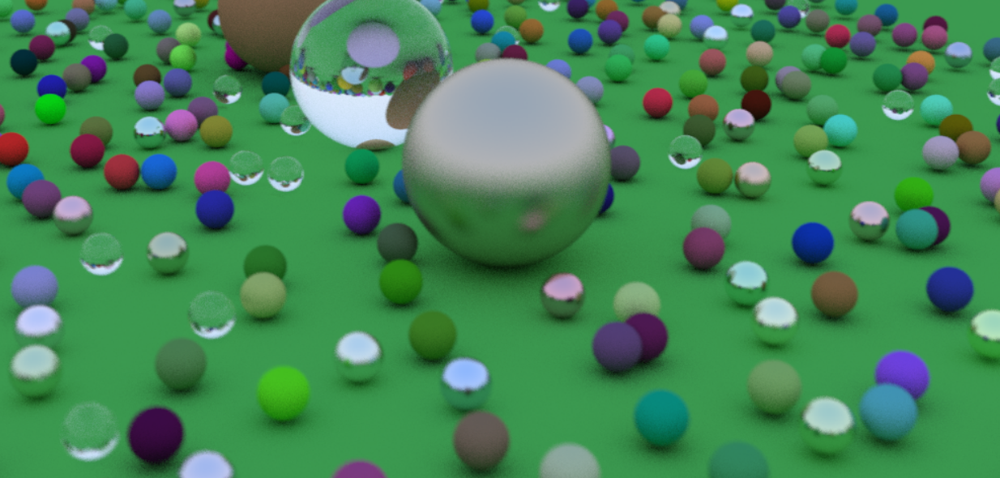

# RUST RAY-TRACER 
Rust implementation of a simple ray-tracer guided by [Ray Tracing in One Weekend](http://www.realtimerendering.com/raytracing/Ray%20Tracing%20in%20a%20Weekend.pdf)


## Quick Start
Make sure you have Rust [installed](https://www.rust-lang.org/tools/install).

Build and run:
```bash
cargo build --release && ./target/release/main
```

It will produce `render.ppm` image file. You can open it with `feh` command:
```bash
feh render.ppm
```




## Tune Options
You can adjust different render options (number of threads, field of view, resolution) in `src/bin/main.rs` and rebuild the project:
```rust
...
let n_threads = 12;
let nx = 400;
let ny = 200;
let vfov = 30.0;
let lookfrom = Vec3::new(15.0, 5.0, 5.0);
let lookat = Vec3::new(0.0, 0.0, -1.0);
...
```
